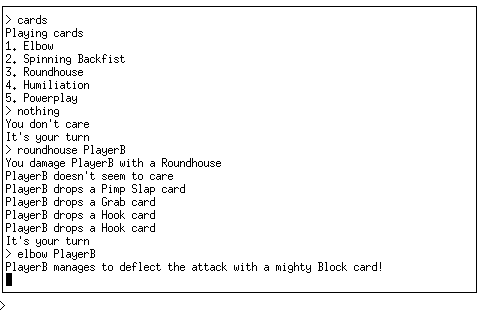
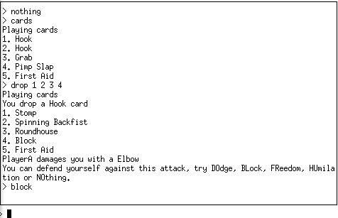

# lunchmoney

While at college, we used to play a silly card game [Lunchmoney](https://www.atlas-games.com/product_tables/AG1100.php). Basically, you have to beat each other up in order to steal that person's lunch money. It's quite fun to kill time, such as the boring breaks between lectures :-)

Anyway, I decided to try to create a networked version of this game. The result was never finished, but it really gives a insight in how such a game could be coded. The server is nice, but the client sucks badly.

## Screenshot

Sample session of player A

Sample session of player B

## Downloads

 * [Final release](releases/lunchmoney.tar.bz2) (26KB)
